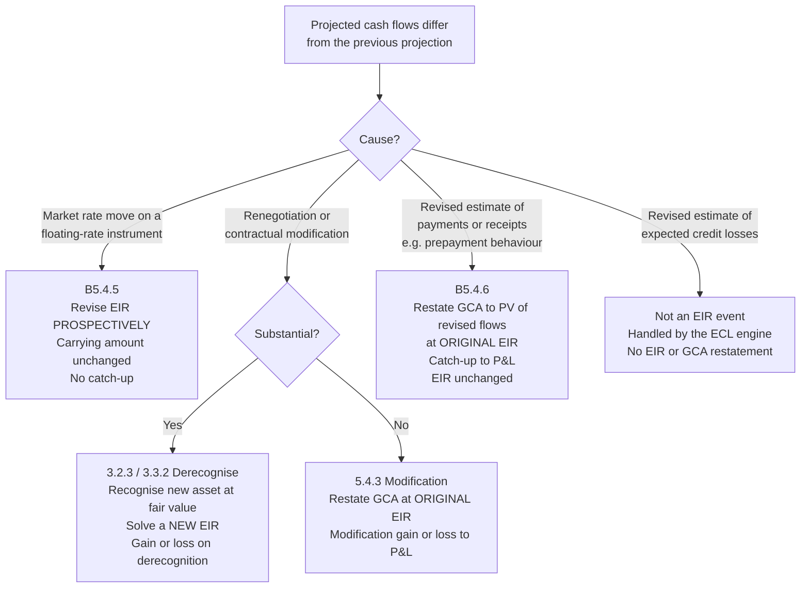

# 01 — Domain Primer

The accounting this engine implements. Written for the engineer who will build it and needs
to know *why* the rules have their shape, not only what they are. Paragraph references are
to IFRS 9; Ind AS 109 is converged on all points used here, and divergences are noted where
they exist.

> Standard references are given so that behaviour can be traced to authority. They are a
> map, not a substitute for the standard or for the entity's own accounting policy, which
> is what the engine is ultimately configured against.

---

## 1. The definitions, and why the wording matters

**Effective interest rate** (IFRS 9 Appendix A) — the rate that exactly discounts estimated
future cash payments or receipts through the expected life of the financial asset or
financial liability to the gross carrying amount of a financial asset or to the amortised
cost of a financial liability.

Four load-bearing phrases:

- **"exactly discounts"** — it is an internal rate of return, found by root-finding. There
  is no closed form once fees are involved.
- **"estimated future"** — estimates, not the contract's face schedule. Expected prepayment
  belongs in the projection where it can be estimated reliably.
- **"expected life"** — behavioural, not contractual, where the two differ. A 20-year
  mortgage book that behaviourally runs off in 7 years has an expected life of 7 years, and
  fees amortise over 7.
- **"gross carrying amount"** — before loss allowance. The EIR is determined without regard
  to expected credit losses. POCI is the sole exception (§7).

**Gross carrying amount** — the amortised cost of a financial asset before adjusting for any
loss allowance.

**Amortised cost** — the amount at initial recognition, minus principal repayments, plus or
minus the cumulative amortisation using the effective interest method of any difference
between that initial amount and the maturity amount, and adjusted for any loss allowance.

The gap between "gross carrying amount" and "amortised cost" is precisely the loss
allowance, and which of the two the EIR is applied to is what changes at Stage 3 (§6). Keep
the two terms distinct in code as well as in prose — conflating them is the most common
implementation defect in this domain.

**Transaction costs** (Appendix A) — incremental costs directly attributable to the
acquisition, issue or disposal of a financial asset or liability. *Incremental* means the
cost would not have been incurred had the entity not entered the transaction. This excludes
internal administrative costs, holding costs, and allocated overhead however directly they
feel attributable.

## 2. Initial recognition: where the fee goes

At initial recognition a financial asset at amortised cost is measured at fair value **plus**
directly attributable transaction costs (IFRS 9 5.1.1). For an originated loan at market
terms, fair value is generally the amount advanced. The arithmetic that follows:

```
Initial gross carrying amount
  = principal advanced
  − integral fees received from the borrower
  + integral costs paid to third parties or as direct incremental internal cost
```

For [Reference Case 1](reference-cases/case-01-emi-loan-with-fees.md):

```
  1,000,000   principal
  −  15,000   processing fee collected from borrower
  +  10,000   DSA commission paid to the sourcing agent
  ───────────
    995,000   initial gross carrying amount
```

Worth noticing: the borrower receives 985,000 in cash and the lender separately pays out
10,000, so the lender's total net cash outflow at inception is 995,000 — exactly the initial
carrying amount. That identity is not a coincidence, and it is a useful invariant to assert
in tests: **the initial carrying amount equals the net cash flow at inception.** Where it
fails to hold, either a fee has been misclassified or a non-cash item has crept in.

### Which fees are integral

IFRS 9 B5.4.1–B5.4.3 draws the line. Integral to the EIR:

- Origination and processing fees on lending — compensation for activities such as
  evaluating the borrower's financial condition, evaluating and recording guarantees and
  collateral, negotiating terms, preparing and processing documents, closing the transaction.
- Commitment fees, **where it is probable** the entity will enter into a specific lending
  arrangement. Deferred and folded into the EIR once the loan is drawn. Where drawdown is
  not probable, the fee is recognised as revenue over the commitment period.
- Origination fees received on issuing financial liabilities.
- Premiums and discounts on acquired debt instruments.
- Incremental third-party costs: DSA and broker commissions, legal fees specific to the
  transaction, credit bureau and valuation charges attributable to the deal.

**Not** integral, and so recognised as incurred or as the service is delivered:

- Servicing and administration fees over the life of the loan.
- Prepayment penalties, bounce charges, late payment fees — contingent on an event, not
  known at inception. These are recognised when the event occurs.
- Fees for a service delivered separately: insurance commission, advisory, cross-sell.
- Internal overhead, staff costs not directly incremental, marketing.
- Fees on a commitment where drawdown is not probable (see above).

This classification is a **policy decision with judgement in it**, applied to fee codes that
originate in other systems and change without notice. It therefore belongs in a versioned,
maker–checker-controlled rule set — not scattered through code. See
[FR-2xx](02-functional-spec.md#22-fee-and-cost-classification-fr-2xx).

### The trap: contingent fees are not integral

A prepayment penalty is not folded into the EIR at inception even though it is written into
the contract, because at inception it is neither estimable nor probable — it depends on
borrower behaviour that may never occur. When the prepayment happens, the penalty is income
in that period. Systems that sweep all contractual charges into the EIR projection get this
wrong and overstate yield across the whole book.

## 3. Determining the rate

Solve for `r` such that the projected cash flows discount exactly to the initial gross
carrying amount:

$$\text{GCA}_0 = \sum_{t} \frac{CF_t}{(1+r)^{\tau_t}}$$

where `τ_t` is the time to flow `t` expressed in the rate's own periodicity. The mechanics,
the choice of `τ` (actual-date versus periodic-index), annualisation, and solver behaviour
are specified in [03 — Calculation Specification](03-calculation-spec.md).

For Case 1 the answer is **1.04214918% per month**, i.e. **13.248094% effective per annum**,
against a contractual 12% nominal (12.682503% effective). The 5,000 of net integral fee has
lifted reported yield by 56.5 basis points.

Two facts about the solution worth internalising:

1. **The EIR is above the contractual rate whenever net integral fees are income**, because
   the asset is recorded below par and must accrete back up. Net integral *costs* push it
   below. A sign check on this relationship is a cheap, high-value invariant.
2. **Total EIR interest over life = total contractual interest + net integral fee.** In
   Case 1: 134,763.28 = 129,763.28 + 5,000.00. The EIR method changes the *timing* of
   recognition, never the total. This is the strongest single reconciliation in the domain
   and the engine should assert it on every completed contract.

## 4. Rolling forward

Each period, on the gross basis:

```
closing GCA = opening GCA + (opening GCA × EIR) − cash received
```

with the middle term being the interest income recognised. Applied over Case 1's 24 months
the balance amortises to exactly zero, which is the arithmetical consequence of the EIR
having been solved to make it so. **Terminal balance is zero** is therefore the second
essential invariant.

The engine reports both legs and their difference, because the contractual leg has to tie
back to the LMS and the borrower's statement:

| Period | EIR interest | Contractual interest | Fee amortised | Unamortised fee c/f |
|---:|---:|---:|---:|---:|
| 1 | 10,369.38 | 10,000.00 | 369.38 | 4,630.62 |
| 2 | 9,986.87 | 9,629.27 | 357.61 | 4,273.01 |
| 3 | 9,600.38 | 9,254.82 | 345.55 | 3,927.46 |
| … | | | | |
| 12 | 5,935.51 | 5,711.77 | 223.74 | 1,408.29 |
| … | | | | |
| 23 | 966.02 | 927.53 | 38.49 | 19.50 |
| 24 | 485.52 | 466.07 | 19.44 | **0.06** |

The "fee amortised" column is the whole point of the exercise: an upfront 5,000 released
across 24 months on a declining-balance basis, front-loaded because the balance it is
computed on is largest early. Straight-lining it — 208.33 a month — is the approximation the
engine exists to avoid.

The 0.06 left standing at period 24 is not an error in the EIR leg — that leg amortises to
exactly zero. It is the *contractual* leg's rounding residue: the billed EMI of 47,073.47 is
the true annuity payment of 47,073.472223 rounded down to paise, and 24 periods of that
shortfall accumulate to 0.059969. Real, unavoidable, and it has to go somewhere by rule
rather than by tolerance — see [03 § rounding residue](03-calculation-spec.md#7-rounding-and-residue-policy).

## 5. When the schedule changes

Three treatments. Choosing the wrong one is the highest-impact error in the domain, so the
decision is made by an explicit, logged classification step rather than inferred.



### B5.4.5 — floating rates: prospective

> "For floating-rate financial assets and floating-rate financial liabilities, periodic
> re-estimation of cash flows to reflect the movements in the market rates of interest alters
> the effective interest rate."

A benchmark reset changes future cash flows for reasons wholly outside the entity's
estimation. The response is to re-solve the EIR over the remaining flows **starting from the
carrying amount already on the books**, and carry on. No restatement, no catch-up.
[Reference Case 4](reference-cases/case-04-floating-rate-reset.md): a 100bp benchmark rise at
month 12 lifts the EIR from 1.04214918% to 1.12558515% per month; the carrying amount stays
at 528,407.32; the P&L adjustment is nil.

### B5.4.6 — revised estimates: retrospective catch-up

> "…the entity shall adjust the gross carrying amount of the financial asset … to reflect
> actual and revised estimated contractual cash flows. The entity recalculates the gross
> carrying amount … as the present value of the estimated future contractual cash flows that
> are discounted at the financial instrument's original effective interest rate…"

Here the entity's own estimate changed — expected prepayment speed, a tenor extension, a
re-profiling. The rate is *not* revised. Instead the balance sheet is restated to what it
should have been all along, discounting revised flows at the **original** EIR, and the
difference goes straight to P&L as a catch-up.
[Reference Case 3](reference-cases/case-03-b546-reestimation.md): a six-month tenor extension
at month 12 restates the carrying amount from 528,407.32 to 527,779.90 — a **627.42 charge**
recognised immediately.

The contrast between Cases 3 and 4 is the single most important thing in this primer. Same
instrument, same month, both "the schedule changed", opposite treatments: 627.42 to P&L
versus nil, rate unchanged versus rate revised. The discriminator is *why* the flows moved.

### 5.4.3 / 3.2.3 — modification versus derecognition

A renegotiation that is **substantial** derecognises the old asset and recognises a new one
at fair value, with a fresh EIR. One that is not substantial is a modification: restate at
the original EIR, recognise a modification gain or loss — mechanically the same as B5.4.6.

The quantitative "10% test" (B3.3.6) — comparing the PV of cash flows under the new terms,
discounted at the original EIR, to the remaining PV under the old — is written for financial
**liabilities**. IFRS 9 sets no equivalent bright line for financial **assets**. Practice
applies the 10% test by analogy alongside qualitative factors: a change of currency or
obligor, introduction of an equity conversion feature, a change that causes the instrument
to fail SPPI, conversion of a revolving facility to a term loan. The engine therefore:

- computes the 10% test and records the result as **evidence**, not as the decision;
- evaluates configured qualitative triggers;
- for assets, treats the outcome as a **recommendation requiring approval** where the test
  lands within a configurable band around the threshold;
- records who decided, on what basis, under which policy version.

This is a deliberate refusal to automate a judgement. Silently derecognising a corporate
loan on a 10.02% test result is not a feature.

### Post-restructuring interest suspension

Where an Indian NBFC restructures under an RBI resolution framework, the regulatory
treatment of interest accrual and asset classification runs on a separate track from Ind AS
109. The engine records the Ind AS position and carries the regulatory classification as an
attribute so both views can be reported; it does not attempt to reconcile the two
automatically. Flagged in the [roadmap](08-roadmap.md) as a phase-3 regulatory-reporting
concern.

## 6. Impairment: the Stage 3 switch

Interest revenue is calculated (IFRS 9 5.4.1) by applying the effective interest rate to:

- the **gross carrying amount** — Stage 1 and Stage 2;
- the **amortised cost**, i.e. net of the loss allowance — Stage 3, once the asset has
  become credit-impaired.

[Reference Case 5](reference-cases/case-05-stage-3-net-basis.md), with a 40% allowance:
gross-basis interest would be 5,506.79; the Stage 3 amount is **3,304.08** on the net
317,044.39. The 2,202.72 difference is not recognised as interest at all.

Three consequences that implementations routinely miss:

1. **The rate does not change.** Only the base does. Stage transfer is not an EIR event.
2. **The Stage 3 amount is still interest income.** It is the unwinding of the discount and
   it is presented within interest revenue — not netted into the impairment line.
3. **It reverses.** If the asset ceases to be credit-impaired, recognition returns to the
   gross basis **prospectively** from that point. No catch-up for the interest not recognised
   while in Stage 3.

Because the allowance moves every period, Stage 3 interest depends on an ECL output. That
dependency is why the engine records the ECL input version it consumed (§ [ADR-0003](adr/0003-event-sourced-recompute.md)):
without it, a replay produces a different answer and determinism is lost.

## 7. POCI: the credit-adjusted EIR

A **purchased or originated credit-impaired** asset — typically a distressed pool bought at a
deep discount — is measured using a **credit-adjusted effective interest rate**: the rate that
discounts the **expected** cash flows, already net of expected credit losses, to the price
paid at initial recognition. Expected losses are inside the rate from the outset rather than
being carried as a separate allowance.

[Reference Case 6](reference-cases/case-06-poci-credit-adjusted-eir.md) shows why this
matters. A pool bought for 700,000 against contractual flows of 24 × 47,073.47, with 20% of
every receipt expected to be lost:

| Basis | Monthly rate | Effective p.a. |
|---|---:|---:|
| Credit-adjusted EIR (expected flows) — **correct** | 2.15405231% | 29.141905% |
| EIR on contractual flows — **wrong** | 4.24580927% | 64.703664% |

Discounting contractual flows to a distressed purchase price yields 64.7% per annum — a
number that is arithmetically impeccable and economically fictional. It would accrue income
the entity has no expectation of collecting, and then reverse it through impairment. The
credit-adjusted rate is what makes the income statement mean something.

Note also that for POCI the credit-adjusted EIR is applied to **amortised cost** from initial
recognition — there is no gross-basis phase.

## 8. Expected life and behaviour

The EIR discounts over *expected* life. Where prepayment can be reliably estimated, expected
life is shorter than contractual and fees amortise faster. This requires a behavioural
assumption — typically a CPR curve by product, vintage and rate differential — sourced from
the entity's own experience.

Three practical positions, in increasing order of sophistication, all of which the engine
supports as a configured policy:

1. **Contractual life.** Simplest, defensible where prepayment is immaterial or not
   reliably estimable. Fees amortise slower; a prepayment then produces a larger
   acceleration to P&L.
2. **Behavioural life via a portfolio CPR curve.** Cash flows projected net of expected
   prepayment. More accurate, requires the assumption to be governed, evidenced and
   periodically back-tested.
3. **Contract-level behavioural scoring.** Rarely justifiable for the added complexity.

A change to the CPR assumption is a **B5.4.6 event across every affected contract** — revised
estimate, restate at original EIR, catch-up to P&L. A one-line assumption change can
therefore move a material number, which is exactly why assumption changes go through
maker–checker with a mandatory impact preview.

## 9. Revolving facilities

Cash credit, overdraft, credit cards and working capital limits have no contractual
repayment schedule, so there is nothing to solve an EIR over in the usual way. Accepted
approaches, selected by policy per product:

- **Amortise the net integral fee over the expected behavioural life of the facility**,
  straight-line, where the drawn balance is volatile and no meaningful schedule exists. Most
  common; simple; requires the behavioural life to be evidenced.
- **EIR over an expected drawdown and repayment profile**, where the utilisation pattern is
  stable and modellable.
- Where the facility is renewed annually and the fee is charged annually, amortising over the
  commitment period is frequently both simplest and closest to the economics.

The engine treats these as a distinct instrument family with its own projection strategy
rather than forcing them through the term-loan path. See
[05 — Architecture § projection strategies](05-architecture.md#43-projection-strategies).

## 10. Liabilities

The same method, mirrored. Issue costs on an NCD — arranger fees, legal, rating agency,
listing — reduce the initial carrying amount of the liability and are amortised through
finance cost via the EIR, lifting the effective cost of borrowing above the coupon. A
discount or premium on issue is folded in identically.

Two asymmetries worth encoding:

- The **10% test is authoritative** for liabilities (B3.3.6), not merely evidential.
- There is no staging and no allowance, so there is no Stage 3 net-basis switch. The gross
  basis always applies.

## 11. Common failure modes

Collected from the domain because they translate directly into test cases. Each is an
acceptance test in [02 — Functional Specification](02-functional-spec.md).

| # | Error | Effect |
|---|---|---|
| 1 | Straight-lining integral fees instead of EIR amortisation | Timing error every period; understates early income on a declining-balance asset |
| 2 | Treating a B5.4.6 revision prospectively | Omits the catch-up; misstates P&L in the event period |
| 3 | Treating a B5.4.5 reset with a catch-up | Fabricates a P&L adjustment that should not exist |
| 4 | Contingent fees folded into the EIR projection at inception | Overstates yield across the book |
| 5 | Stage 3 interest still accrued on the gross carrying amount | Overstates interest income; misclassifies the offset into impairment |
| 6 | Reverting from Stage 3 with a catch-up | Recognises interest that was correctly never recognised |
| 7 | POCI measured on contractual rather than expected flows | Grossly overstates yield (Case 6: 64.7% versus 29.1%) |
| 8 | EIR frozen at origination on a floating-rate book | Progressive divergence from B5.4.5 |
| 9 | Unamortised fee written off to suspense on prepayment | Unexplained P&L; unreconciled fee balance |
| 10 | Double-counting a fee that is both an integral fee and a separately-billed service | Overstates income; fails the total-interest reconciliation |
| 11 | Rate solved on rounded cash flows but rolled forward on unrounded (or vice versa) | Non-zero terminal balance; a residue that grows with tenor |
| 12 | Binary floating-point for money | Irreproducible cents; failed reconciliations that cannot be diagnosed |
| 13 | Expected life set to contractual on a fast-prepaying book | Under-amortises fees; large unexplained acceleration on closure |
| 14 | Ignoring the fee on undrawn commitments that are probable of drawdown | Recognises commitment income too early |

## 12. Further reading

- IFRS 9 *Financial Instruments*, §5.4 (amortised cost measurement), Appendix A
  (definitions), B5.4.1–B5.4.7 (application guidance on EIR, fees and revisions),
  B3.3.6 (the 10% test), §3.2 (derecognition).
- Ind AS 109, converged text; read alongside ICAI implementation guidance for
  India-specific fee patterns (DSA commission, co-lending, direct assignment).
- IFRS 7 / Ind AS 107 for the disclosure requirements the engine's reports feed.
- RBI directions on income recognition and asset classification, for the parallel
  regulatory view referenced in §5.
