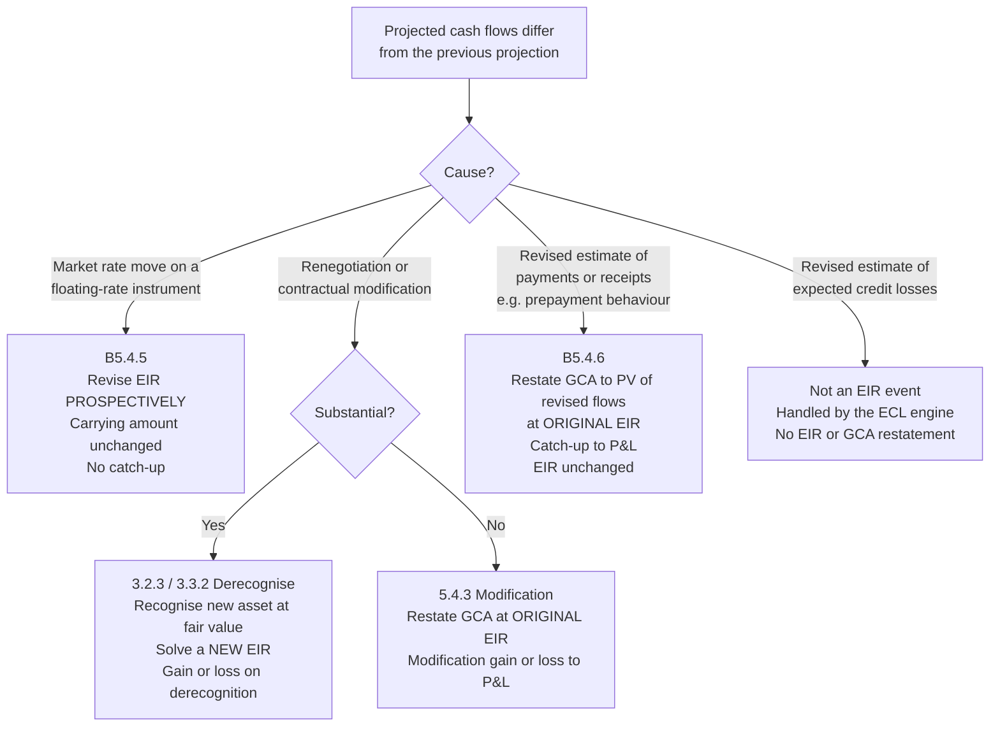

# 01 — Domain Primer

The accounting this engine implements. Written for the engineer who will build it and needs to
know *why* the rules have their shape, not only what they are.

**Regulatory anchor: RBI ACPIR 2026**, effective 1 April 2027. ACPIR carries only nine operative EIR
paragraphs, so most of the *mechanics* below come from IFRS 9 — adopted as an **interpretive source**
where ACPIR is silent, under the hierarchy at
[03 §2](03-calculation-spec.md#2-interpretive-hierarchy). References of the form `ACPIR 51` are to
the Directions; `B5.4.6` to IFRS 9 application guidance.

> Two places where ACPIR **overrides** IFRS 9 rather than being silent, and both change the
> engine's behaviour: **Stage 3 income is not recognised at all** (§6), and **penal charges are
> hard-excluded** from every EIR stream (§2). Read those two sections even if you skip the rest.
>
> Standard references are a map, not a substitute for the Directions or for the bank's own
> Board-approved accounting policy, which is what the engine is ultimately configured against. The
> full domain treatment — silence map, 38-product matrix, divergence register — is the
> [ACPIR 2026 application reference](reference/acpir-2026-eir-application-reference.md).

---

## 1. The definitions, and why the wording matters

**Effective interest rate** (IFRS 9 Appendix A) — the rate that exactly discounts estimated
future cash payments or receipts through the expected life of the financial asset or
financial liability to the gross carrying amount of a financial asset or to the amortised
cost of a financial liability.

Four load-bearing phrases:

- **"exactly discounts"** — it is an internal rate of return, found by root-finding. There
  is no closed form once fees are involved.
- **"estimated future"** — estimates, not the contract's face schedule. Expected prepayment
  belongs in the projection where it can be estimated reliably.
- **"expected life"** — behavioural, not contractual, where the two differ. A 20-year
  mortgage book that behaviourally runs off in 7 years has an expected life of 7 years, and
  fees amortise over 7.
- **"gross carrying amount"** — before loss allowance. The EIR is determined without regard
  to expected credit losses. POCI is the sole exception (§7).

**Gross carrying amount** — the amortised cost of a financial asset before adjusting for any
loss allowance.

**Amortised cost** — the amount at initial recognition, minus principal repayments, plus or
minus the cumulative amortisation using the effective interest method of any difference
between that initial amount and the maturity amount, and adjusted for any loss allowance.

The gap between "gross carrying amount" and "amortised cost" is precisely the loss
allowance, and which of the two the EIR is applied to is what changes at Stage 3 (§6). Keep
the two terms distinct in code as well as in prose — conflating them is the most common
implementation defect in this domain.

**Transaction costs** (Appendix A) — incremental costs directly attributable to the
acquisition, issue or disposal of a financial asset or liability. *Incremental* means the
cost would not have been incurred had the entity not entered the transaction. This excludes
internal administrative costs, holding costs, and allocated overhead however directly they
feel attributable.

## 2. Initial recognition: where the fee goes

At initial recognition a financial asset at amortised cost is measured at fair value **plus**
directly attributable transaction costs (IFRS 9 5.1.1). For an originated loan at market
terms, fair value is generally the amount advanced. The arithmetic that follows:

```
Initial gross carrying amount
  = principal advanced
  − integral fees received from the borrower
  + integral costs paid to third parties or as direct incremental internal cost
```

For [Reference Case 1](reference-cases/case-01-emi-loan-with-fees.md):

```
  1,000,000   principal
  −  15,000   processing fee collected from borrower
  +  10,000   DSA commission paid to the sourcing agent
  ───────────
    995,000   initial gross carrying amount
```

Worth noticing: the borrower receives 985,000 in cash and the lender separately pays out
10,000, so the lender's total net cash outflow at inception is 995,000 — exactly the initial
carrying amount. That identity is not a coincidence, and it is a useful invariant to assert
in tests: **the initial carrying amount equals the net cash flow at inception.** Where it
fails to hold, either a fee has been misclassified or a non-cash item has crept in.

### Which fees are integral

IFRS 9 B5.4.1–B5.4.3 draws the line. Integral to the EIR:

- Origination and processing fees on lending — compensation for activities such as
  evaluating the borrower's financial condition, evaluating and recording guarantees and
  collateral, negotiating terms, preparing and processing documents, closing the transaction.
- Commitment fees, **where it is probable** the entity will enter into a specific lending
  arrangement. Deferred and folded into the EIR once the loan is drawn. Where drawdown is
  not probable, the fee is recognised as revenue over the commitment period.
- Origination fees received on issuing financial liabilities.
- Premiums and discounts on acquired debt instruments.
- Incremental third-party costs: DSA and broker commissions, legal fees specific to the
  transaction, credit bureau and valuation charges attributable to the deal.

**Not** integral, and so recognised as incurred or as the service is delivered:

- Servicing and administration fees over the life of the loan.
- Prepayment penalties, bounce charges, late payment fees — contingent on an event, not
  known at inception. These are recognised when the event occurs.
- Fees for a service delivered separately: insurance commission, advisory, cross-sell.
- Internal overhead, staff costs not directly incremental, marketing.
- Fees on a commitment where drawdown is not probable (see above).

This classification is a **policy decision with judgement in it**, applied to fee codes that
originate in other systems and change without notice. It therefore belongs in a versioned,
maker–checker-controlled rule set — not scattered through code. See
[FR-2xx](02-functional-spec.md#22-fee-and-cost-classification-fr-2xx).

### The ACPIR overlay on fees

Three India-specific points sit on top of the IFRS 9 framing above.

**ACPIR 52 states only the positive limb.** Origination fees and commitment fees to originate a loan
are integral. There is **no negative list** — the B5.4.3 catalogue of what is *not* integral has no
ACPIR equivalent, so without policy a bank has no principled basis to keep any fee out. The engine
adopts B5.4.2 and B5.4.3 in full as configured policy.

**ACPIR 52 also drops the "probable drawdown" condition** on commitment fees. Read literally, every
commitment fee defers — including on facilities that were never going to draw. The engine restores the
condition and requires a numeric `drawdown_probability` assessment per product, evidenced by
historical drawdown rates.

**ACPIR 53 draws the line at *selling*, not *processing*.** Fees and commission paid to agents
"including employees acting as selling agents" are capitalisable transaction costs. Salary of the
credit-appraisal team is internal administrative cost, explicitly excluded. So a branch-staff
incentive for *sourcing* a loan capitalises; the cost of *assessing* it does not. Source HR and
cost-centre data is structured along neither line, which makes this an early data-sourcing
workstream rather than a late accounting one — and the longest-lead item in the programme
([08 §0](08-roadmap.md#0-the-sequencing-argument)).

### Penal charges: excluded entirely, by Direction

Under RBI's 2023 penal charges framework these are **charges**, not penal *interest*: they are not
capitalised and they bear no further interest. They therefore cannot enter the amortisation schedule
or the gross carrying amount at all.

This has no IFRS 9 analogue, and it is implemented as a **filter at the ingestion boundary rather
than a judgement in the rule set** — a posting classified `EXCLUDED_BY_DIRECTION` is rejected from
every EIR stream, and the rejection is logged as a positive assertion for the period (invariant
PC-1, control C-03). The reason it is an assertion rather than an assumption: legacy core banking
systems routinely book penal amounts into the interest ledger, so the engine has to prove the
exclusion held rather than trust that it did.

### The trap: contingent fees are not integral

A prepayment penalty is not folded into the EIR at inception even though it is written into
the contract, because at inception it is neither estimable nor probable — it depends on
borrower behaviour that may never occur. When the prepayment happens, the penalty is income
in that period. Systems that sweep all contractual charges into the EIR projection get this
wrong and overstate yield across the whole book.

## 3. Determining the rate

Solve for `r` such that the projected cash flows discount exactly to the initial gross
carrying amount:

$$\text{GCA}_0 = \sum_{t} \frac{CF_t}{(1+r)^{\tau_t}}$$

where `τ_t` is the time to flow `t` expressed in the rate's own periodicity. The mechanics,
the choice of `τ` (actual-date versus periodic-index), annualisation, and solver behaviour
are specified in [03 — Calculation Specification](03-calculation-spec.md).

For Case 1 the answer is **1.04214918% per month**, i.e. **13.248094% effective per annum**,
against a contractual 12% nominal (12.682503% effective). The 5,000 of net integral fee has
lifted reported yield by 56.5 basis points.

Two facts about the solution worth internalising:

1. **The EIR is above the contractual rate whenever net integral fees are income**, because
   the asset is recorded below par and must accrete back up. Net integral *costs* push it
   below. A sign check on this relationship is a cheap, high-value invariant.
2. **Total EIR interest over life = total contractual interest + net integral fee.** In
   Case 1: 134,763.28 = 129,763.28 + 5,000.00. The EIR method changes the *timing* of
   recognition, never the total. This is the strongest single reconciliation in the domain
   and the engine should assert it on every completed contract.

## 4. Rolling forward

Each period, on the gross basis:

```
closing GCA = opening GCA + (opening GCA × EIR) − cash received
```

with the middle term being the interest income recognised. Applied over Case 1's 24 months
the balance amortises to exactly zero, which is the arithmetical consequence of the EIR
having been solved to make it so. **Terminal balance is zero** is therefore the second
essential invariant.

The engine reports both legs and their difference, because the contractual leg has to tie
back to the LMS and the borrower's statement:

| Period | EIR interest | Contractual interest | Fee amortised | Unamortised fee c/f |
|---:|---:|---:|---:|---:|
| 1 | 10,369.38 | 10,000.00 | 369.38 | 4,630.62 |
| 2 | 9,986.87 | 9,629.27 | 357.61 | 4,273.01 |
| 3 | 9,600.38 | 9,254.82 | 345.55 | 3,927.46 |
| … | | | | |
| 12 | 5,935.51 | 5,711.77 | 223.74 | 1,408.29 |
| … | | | | |
| 23 | 966.02 | 927.53 | 38.49 | 19.50 |
| 24 | 485.52 | 466.07 | 19.44 | **0.06** |

The "fee amortised" column is the whole point of the exercise: an upfront 5,000 released
across 24 months on a declining-balance basis, front-loaded because the balance it is
computed on is largest early. Straight-lining it — 208.33 a month — is the approximation the
engine exists to avoid.

The 0.06 left standing at period 24 is not an error in the EIR leg — that leg amortises to
exactly zero. It is the *contractual* leg's rounding residue: the billed EMI of 47,073.47 is
the true annuity payment of 47,073.472223 rounded down to paise, and 24 periods of that
shortfall accumulate to 0.059969. Real, unavoidable, and it has to go somewhere by rule
rather than by tolerance — see [03 §5.7](03-calculation-spec.md#57-rounding-and-residue-policy).

## 5. When the schedule changes

Three treatments. Choosing the wrong one is the highest-impact error in the domain, so the
decision is made by an explicit, logged classification step rather than inferred.



### B5.4.5 — floating rates: prospective

> "For floating-rate financial assets and floating-rate financial liabilities, periodic
> re-estimation of cash flows to reflect the movements in the market rates of interest alters
> the effective interest rate."

A benchmark reset changes future cash flows for reasons wholly outside the entity's
estimation. The response is to re-solve the EIR over the remaining flows **starting from the
carrying amount already on the books**, and carry on. No restatement, no catch-up.
[Reference Case 4](reference-cases/case-04-floating-rate-reset.md): a 100bp benchmark rise at
month 12 lifts the EIR from 1.04214918% to 1.12558515% per month; the carrying amount stays
at 528,407.32; the P&L adjustment is nil.

### B5.4.6 — revised estimates: retrospective catch-up

> "…the entity shall adjust the gross carrying amount of the financial asset … to reflect
> actual and revised estimated contractual cash flows. The entity recalculates the gross
> carrying amount … as the present value of the estimated future contractual cash flows that
> are discounted at the financial instrument's original effective interest rate…"

Here the entity's own estimate changed — expected prepayment speed, a tenor extension, a
re-profiling. The rate is *not* revised. Instead the balance sheet is restated to what it
should have been all along, discounting revised flows at the **original** EIR, and the
difference goes straight to P&L as a catch-up.
[Reference Case 3](reference-cases/case-03-b546-reestimation.md): a six-month tenor extension
at month 12 restates the carrying amount from 528,407.32 to 527,779.90 — a **627.42 charge**
recognised immediately.

The contrast between Cases 3 and 4 is the single most important thing in this primer. Same
instrument, same month, both "the schedule changed", opposite treatments: 627.42 to P&L
versus nil, rate unchanged versus rate revised. The discriminator is *why* the flows moved.

### 5.4.3 / 3.2.3 — modification versus derecognition

A renegotiation that is **substantial** derecognises the old asset and recognises a new one
at fair value, with a fresh EIR. One that is not substantial is a modification: restate at
the original EIR, recognise a modification gain or loss — mechanically the same as B5.4.6.

The quantitative "10% test" (B3.3.6) — comparing the PV of cash flows under the new terms,
discounted at the original EIR, to the remaining PV under the old — is written for financial
**liabilities**. IFRS 9 sets no equivalent bright line for financial **assets**. Practice
applies the 10% test by analogy alongside qualitative factors: a change of currency or
obligor, introduction of an equity conversion feature, a change that causes the instrument
to fail SPPI, conversion of a revolving facility to a term loan. The engine therefore:

- computes the 10% test and records the result as **evidence**, not as the decision;
- evaluates configured qualitative triggers;
- for assets, treats the outcome as a **recommendation requiring approval** where the test
  lands within a configurable band around the threshold;
- records who decided, on what basis, under which policy version.

This is a deliberate refusal to automate a judgement. Silently derecognising a corporate
loan on a 10.02% test result is not a feature.

### Post-restructuring interest suspension

Where an Indian NBFC restructures under an RBI resolution framework, the regulatory
treatment of interest accrual and asset classification runs on a separate track from Ind AS
109. The engine records the Ind AS position and carries the regulatory classification as an
attribute so both views can be reported; it does not attempt to reconcile the two
automatically. Flagged in the [roadmap](08-roadmap.md) as a phase-3 regulatory-reporting
concern.

## 6. Impairment: Stage 3, where India diverges

Under IFRS 9 5.4.1 interest revenue is calculated by applying the EIR to:

- the **gross carrying amount** — Stage 1 and Stage 2;
- the **amortised cost**, net of the loss allowance — Stage 3, once credit-impaired.

**ACPIR does not follow the second limb. Income is not recognised on Stage 3 at all**, and the
Seventh Amendment Directions protect that treatment from an auditor qualification on the basis that
the standard permits postponement where collectability is significantly uncertain. Functionally it is
a non-accrual regime, closer to US practice than to IFRS 9 — which is a defensible framing rather
than an embarrassment.

But the engine cannot simply stop computing, because **ACPIR 50 makes the EIR the ECL discount
rate**. Expected credit loss is a present-value measure, so its discount unwinds mechanically every
period whether or not anything is recognised. The engine must compute the unwind and keep it out of
the P&L.

### The decomposition

[Reference Case 5](reference-cases/case-05-stage-3-acpir-suppression.md), with a 40% allowance on a
528,407.32 gross carrying amount:

| | Quantity | Amount |
|---|---|---:|
| (a) | Gross-basis interest, `GCA × EIR` — what Stage 1/2 would recognise | 5,506.79 |
| (b) | IFRS 9 Stage 3 net-basis interest, `AC × EIR` | 3,304.08 |
| (c) | ECL discount unwind, `allowance × EIR` | 2,202.72 |
| | **Recognised in P&L under ACPIR** | **0.00** |

**(b) + (c) = (a), exactly.** 3,304.08 + 2,202.72 = 5,506.79.

That identity is the single most useful fact in this section. The ECL discount unwind is *precisely*
the interest the gross basis would have earned on the allowance portion of the balance — so there is
no separate unwind model to build. The engine computes one gross-basis figure and decomposes it.
IFRS 9 recognises (b) and books (c) inside impairment; ACPIR recognises neither.

### What the engine therefore maintains

Four parallel quantities per Stage 3 contract per period, all reconciled (control C-04):

1. **Gross carrying amount** — continues rolling forward on the gross basis.
2. **Shadow EIR unwind** — 2,202.72 here. Retained for the ECL roll-forward. Never P&L.
3. **Interest-in-suspense** — the contractual interest billed but not recognised, 5,298.16 here. A
   **first-class ledger object**, not a memorandum note. The Hong Kong precedent is that a suspense
   regime reconciles to accounting EIR only when the suspense ledger is a real object.
4. **Recognised interest income** — zero.

**ACPIR does not say where the unwind goes.** IFRS practice debates whether it is interest revenue or
an impairment-line movement; India needs a third answer, because it is neither recognised as income
nor released. This is an open question the bank must close by Board-approved policy, and it is a
legitimate candidate for a collective industry clarification request.

### Three consequences implementations routinely miss

1. **The rate does not change.** Staging is not an EIR event. Only what happens to the *result*
   changes.
2. **The gross carrying amount does not change either.** ACPIR 6(12) keeps it gross; the allowance
   sits separately, and Stage 1/2 provisions are presented separately rather than netted from gross
   advances.
3. **Cure is prospective.** Recognition resumes on the gross basis from that point, with **no
   catch-up** for interest not recognised while in Stage 3. Booking one would recognise income that
   was correctly never recognised.

### The card-book problem

Account-level suspension analysis is impractical for credit cards and KCC at volume — ACPIR
46(2)(iii) simultaneously mandates behavioural analysis of default patterns, drawdown behaviour and
the effectiveness of limit actions. ACPIR provides no portfolio carve-out for suspension, so one must
come from policy; the HKMA's explicit portfolio treatment for portfolio-managed products is the
available precedent.

### Why this couples the two engines

Stage 3 measurement depends on an allowance that moves every period and is an ECL engine output. The
engine therefore records the **ECL input version it consumed** — without it a replay computes a
different answer and determinism is lost for reasons that have nothing to do with this engine. That
dependency, plus ACPIR 50 making the EIR the ECL discount rate, is why EIR must be sequenced
*upstream* of the ECL build ([08 §0](08-roadmap.md#0-the-sequencing-argument)).

## 7. POCI: the credit-adjusted EIR

A **purchased or originated credit-impaired** asset — typically a distressed pool bought at a
deep discount — is measured using a **credit-adjusted effective interest rate**: the rate that
discounts the **expected** cash flows, already net of expected credit losses, to the price
paid at initial recognition. Expected losses are inside the rate from the outset rather than
being carried as a separate allowance.

[Reference Case 6](reference-cases/case-06-poci-credit-adjusted-eir.md) shows why this
matters. A pool bought for 700,000 against contractual flows of 24 × 47,073.47, with 20% of
every receipt expected to be lost:

| Basis | Monthly rate | Effective p.a. |
|---|---:|---:|
| Credit-adjusted EIR (expected flows) — **correct** | 2.15405231% | 29.141905% |
| EIR on contractual flows — **wrong** | 4.24580927% | 64.703664% |

Discounting contractual flows to a distressed purchase price yields 64.7% per annum — a
number that is arithmetically impeccable and economically fictional. It would accrue income
the entity has no expectation of collecting, and then reverse it through impairment. The
credit-adjusted rate is what makes the income statement mean something.

Note also that for POCI the credit-adjusted EIR is applied to **amortised cost** from initial
recognition — there is no gross-basis phase.

## 8. Expected life and behaviour

The EIR discounts over *expected* life. Where prepayment can be reliably estimated, expected
life is shorter than contractual and fees amortise faster. This requires a behavioural
assumption — typically a CPR curve by product, vintage and rate differential — sourced from
the entity's own experience.

Three practical positions, in increasing order of sophistication, all of which the engine
supports as a configured policy:

1. **Contractual life.** Simplest, defensible where prepayment is immaterial or not
   reliably estimable. Fees amortise slower; a prepayment then produces a larger
   acceleration to P&L.
2. **Behavioural life via a portfolio CPR curve.** Cash flows projected net of expected
   prepayment. More accurate, requires the assumption to be governed, evidenced and
   periodically back-tested.
3. **Contract-level behavioural scoring.** Rarely justifiable for the added complexity.

A change to the CPR assumption is a **B5.4.6 event across every affected contract** — revised
estimate, restate at original EIR, catch-up to P&L. A one-line assumption change can
therefore move a material number, which is exactly why assumption changes go through
maker–checker with a mandatory impact preview.

## 9. Revolving facilities

Cash credit, overdraft, credit cards and working capital limits have no contractual
repayment schedule, so there is nothing to solve an EIR over in the usual way. Accepted
approaches, selected by policy per product:

- **Amortise the net integral fee over the expected behavioural life of the facility**,
  straight-line, where the drawn balance is volatile and no meaningful schedule exists. Most
  common; simple; requires the behavioural life to be evidenced.
- **EIR over an expected drawdown and repayment profile**, where the utilisation pattern is
  stable and modellable.
- Where the facility is renewed annually and the fee is charged annually, amortising over the
  commitment period is frequently both simplest and closest to the economics.

The engine treats these as a distinct instrument family with its own projection strategy
rather than forcing them through the term-loan path. See
[05 — Architecture § projection strategies](05-architecture.md#43-projection-strategies).

## 10. Liabilities

The same method, mirrored. Issue costs on an NCD — arranger fees, legal, rating agency,
listing — reduce the initial carrying amount of the liability and are amortised through
finance cost via the EIR, lifting the effective cost of borrowing above the coupon. A
discount or premium on issue is folded in identically.

Two asymmetries worth encoding:

- The **10% test is authoritative** for liabilities (B3.3.6), not merely evidential.
- There is no staging and no allowance, so there is no Stage 3 net-basis switch. The gross
  basis always applies.

## 11. Common failure modes

Collected from the domain because they translate directly into test cases. Each is an acceptance test
in [02 §4](02-functional-spec.md#4-acceptance-tests-derived-from-known-failure-modes).

### Universal

| # | Error | Effect |
|---|---|---|
| 1 | Straight-lining integral fees instead of EIR amortisation | Timing error every period. On a 15-year zero-coupon, **year 1 overstated by 81%** — [Case 9](reference-cases/case-09-straight-line-vs-eir.md) |
| 2 | Treating a re-estimation prospectively | Omits the catch-up; misstates P&L in the event period |
| 3 | Treating a benchmark reset with a catch-up | Fabricates a P&L adjustment that should not exist |
| 4 | Contingent fees folded into the projection at inception | Overstates yield across the book |
| 5 | POCI measured on contractual rather than expected flows | Grossly overstates yield — 64.7% vs 29.1% in [Case 6](reference-cases/case-06-poci-credit-adjusted-eir.md) |
| 6 | EIR frozen at origination on a floating-rate book | Progressive divergence from the reset mechanic |
| 7 | Unamortised fee written off to suspense on prepayment | Unexplained P&L; unreconciled fee balance |
| 8 | Double-counting a fee that is both integral and a separately-billed service | Overstates income; fails the total-interest reconciliation |
| 9 | Rate solved on rounded flows but rolled forward on unrounded | Non-zero terminal balance; residue growing with tenor |
| 10 | Binary floating-point for money | Irreproducible paise; failed reconciliations that cannot be diagnosed |
| 11 | Expected life set to contractual on a fast-prepaying book | Under-amortises fees; large unexplained acceleration on closure |
| 12 | Ignoring fees on undrawn commitments probable of drawdown | Recognises commitment income too early |
| 13 | **Silent fallback to the contractual rate on non-convergence** | **Reproduces the pre-ACPIR position invisibly.** Plausible numbers, no trace. The most damaging failure available. |

### India-specific — no IFRS 9 analogue

| # | Error | Effect |
|---|---|---|
| 14 | Stage 3 interest recognised at all (on either basis) | Recognises income ACPIR suppresses |
| 15 | Stage 3 unwind not computed because income is not recognised | ECL discounting silently wrong — ACPIR 50 makes the EIR the discount rate |
| 16 | Cure booked with a catch-up | Recognises income that was correctly never recognised |
| 17 | Penal charges reaching the interest ledger and thence the GCA | Inflates the carrying amount and the EIR; breaches the 2023 framework |
| 18 | Pre-floor ECL overwritten by the prudential floor | Loses the accounting number ACPIR 90 requires alongside the floor |
| 19 | Gold loans grouped under secured retail | Breaches ACPIR 92; corrupts the shared product taxonomy the floor engine also consumes |
| 20 | EIR expected life and ECL horizon sharing one field | Conflates ACPIR 51 with ACPIR 46(1); cannot be fixed later without reworking history |
| 21 | Tier 3 approximation with no equivalence test on file | The Cambodia failure mode — an undocumented shortcut |
| 22 | Discontinued hedge with a frozen basis adjustment | Misstates interest in every period through to maturity, recurring indefinitely |
| 23 | Swap or hedging cost inside an EIR cash flow stream | ACPIR 53 excludes financing costs; corrupts the rate |
| 24 | Reset-versus-catch-up hard-coded | Re-engineering event when the IASB Exposure Draft lands; historical replay becomes wrong |

Failure 15 is the one worth dwelling on, because it is *invited* by the Indian rule. A team told
"India does not recognise Stage 3 income" reasonably concludes there is nothing to compute — and
silently breaks ECL discounting. The unwind must be computed and suppressed, not skipped
([§6](#6-impairment-stage-3-where-india-diverges)).

## 12. Further reading

- **RBI ACPIR 2026** — the binding anchor. EIR at paragraphs 6(1), 6(4), 6(6), 6(12), 6(29), 19–24,
  50–54. Read 51, 52 and 53 verbatim; they are short and they are the whole positive statement.
- **Seventh Amendment Directions, 2026** — Stage 3 non-recognition protection; Schedule 13
  compilation; the credit-quality and loss-allowance reconciliation tables.
- **Investment Portfolio Directions** — governs the investment book by virtue of ACPIR 22.
- **RBI penal charges framework, 2023** — basis for the §2 hard exclusion.
- **[ACPIR 2026 application reference](reference/acpir-2026-eir-application-reference.md)** — the
  silence map, 38-product matrix, 18-item divergence register, jurisdiction dossiers, and the live
  IASB project. Start here for anything this primer treats briefly.
- IFRS 9 *Financial Instruments*, §5.4 (amortised cost measurement), Appendix A
  (definitions), B5.4.1–B5.4.7 (application guidance on EIR, fees and revisions),
  B3.3.6 (the 10% test), §3.2 (derecognition).
- Ind AS 109, converged text; read alongside ICAI implementation guidance for
  India-specific fee patterns (DSA commission, co-lending, direct assignment).
- IFRS 7 / Ind AS 107 for the disclosure requirements the engine's reports feed.
- RBI directions on income recognition and asset classification, for the parallel
  regulatory view referenced in §5.
