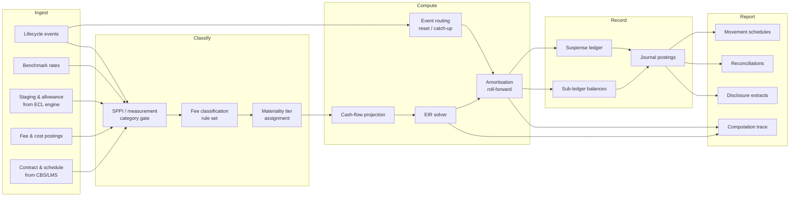

# 02 — Functional Specification

Capabilities and numbered functional requirements. Requirement IDs are stable and referenced from
tests, the [roadmap](08-roadmap.md), and the [reference cases](reference-cases/README.md).

Anchored on ACPIR 2026; see [03 §2](03-calculation-spec.md#2-interpretive-hierarchy) for the
interpretive hierarchy that resolves ACPIR's silences.

---

## 1. Capability map

---

## 2. Functional requirements

### 2.1 Instrument onboarding and classification (FR-1xx)

| ID | Requirement |
|---|---|
| FR-101 | Ingest contract master data per the [data model](04-data-model.md), rejecting any record missing a mandatory attribute into the exception queue with the failing field named. |
| FR-102 | Accept an externally-supplied contractual repayment schedule as a first-class input (`LMS_AUTHORITATIVE`), and derive one only where none is supplied. |
| FR-103 | Apply the **measurement-category gate before any EIR work**: amortised cost, FVOCI, or FVTPL. An instrument at FVTPL carries no EIR and must be excluded from EIR processing entirely. |
| FR-104 | Record the SPPI assessment outcome as an instrument attribute with its date and approver. On the **asset** side an SPPI failure sends the whole instrument to FVTPL — there is no bifurcation. |
| FR-105 | On the **liability** side, bifurcate an embedded derivative to FVTPL and retain an EIR on the host. Applies to structured deposits issued. |
| FR-106 | Assign a **single product tag aligned to the ACPIR 82 floor categories**, shared with the provisioning engine. Reject any attempt to group gold loans under secured retail (ACPIR 92). |
| FR-107 | Assign a materiality tier (1/2/3) per [03 §10](03-calculation-spec.md#10-the-materiality-tier-gate) and record the basis. |
| FR-108 | Maintain **EIR expected life and ECL horizon as separate attributes**, never deriving one from the other, and record the reconciliation basis where they differ. |
| FR-109 | Support parallel books so an IGAAP or tax basis can be maintained alongside the ACPIR basis on the same contract. |
| FR-110 | Identify POCI on **acquisition terms** — a discount reflecting inherent credit losses (ACPIR 6(3)(v)) — at origination and at transition. |

### 2.2 Fee and cost classification (FR-2xx)

| ID | Requirement |
|---|---|
| FR-201 | Resolve every fee and cost posting to `INTEGRAL`, `AS_INCURRED`, `OVER_COMMITMENT_PERIOD`, `SEPARATE_SERVICE`, or `EXCLUDED_BY_DIRECTION` via a versioned rule set keyed on `(fee_code, product, entity, effective_date)`. |
| FR-202 | **Fail an unmapped fee code into the exception queue.** Never default silently to either treatment. |
| FR-203 | Distinguish employee **selling-agent** incentives (capitalisable, ACPIR 53) from internal credit-appraisal cost (excluded). Reject a posting whose `cost_function` attribute is absent. |
| FR-204 | Require a numeric `drawdown_probability` assessment on commitment fees, with a per-product threshold; route below-threshold fees to `OVER_COMMITMENT_PERIOD` and recognise on expiry if undrawn. |
| FR-205 | Bifurcate syndication fees where the arranger's fee share is disproportionate to its retained share: excess to arrangement service income, balance to the EIR. |
| FR-206 | Exclude contingent fees — prepayment penalty, late fee, bounce charge — from the inception projection and recognise them in the period the event occurs. |
| FR-207 | **Hard-exclude `EXCLUDED_BY_DIRECTION` postings (penal charges) at the ingestion boundary** from every EIR stream and from the gross carrying amount, and emit a positive assertion for the period (invariant PC-1). |
| FR-208 | Exclude hedging and swap costs from every EIR cash flow stream (ACPIR 53, invariant HB-2). |
| FR-209 | Exclude government interest subvention from the EIR unless the contract makes the borrower's own rate contingent on it; account for it separately. Apply the same position consistently across agriculture, education and MSME. |
| FR-210 | Support maker–checker on rule-set versions, with an effective date and a stored portfolio-level impact preview generated before the version can go effective. |

### 2.3 Projection (FR-3xx)

| ID | Requirement |
|---|---|
| FR-301 | Emit both a contractual and an expected flow vector per contract, and record whether expected-life equals contractual by policy choice or by absence of assumption. |
| FR-302 | Support instrument families: EMI annuity, step-up/step-down, bullet, balloon, structured, moratorium (with and without interest capitalisation), tranched disbursement, revolving, discount instruments. |
| FR-303 | Select periodic-index versus actual-date convention by **checked precondition**, never assumption; default and fall back to actual-date. |
| FR-304 | Implement day-count conventions `ACT/ACT`, `ACT/365F`, `ACT/360`, `30/360`, `30E/360`, `ACT/365L`, per instrument, defaulting per product. |
| FR-305 | Capitalise interest accrued during a moratorium into the gross carrying amount, computing the EIR over expected life inclusive of the moratorium (ACPIR 9(6)(i) for education loans; IDC pre-COD for project finance). |
| FR-306 | Apply behavioural prepayment (CPR) curves by product, vintage and segment where policy elects behavioural life. |
| FR-307 | For revolving facilities, apply the configured approximation — fee over the renewal/sanction period, or EIR over an expected utilisation profile (ACPIR 54). |
| FR-308 | For credit cards, derive behavioural life from the ACPIR 46(2)(iii) analysis, and accrete interest only on revolving balances. |
| FR-309 | Append a synthetic `NOTIONAL_REDEMPTION` flow at the next repricing date where the B5.4.4 election applies (FR-508). |
| FR-310 | Support the ACPIR 51 fallback to contractual cash flows over the full contractual term as an explicit per-contract election recording its justification, and **report on its incidence**. |

### 2.4 EIR determination (FR-4xx)

| ID | Requirement |
|---|---|
| FR-401 | Solve the EIR by Newton–Raphson within a guaranteed bracket, with **mandatory** bisection fallback. |
| FR-402 | Raise `NoSolution` to the exception queue on no sign change. **Never default to zero or to the contractual rate.** |
| FR-403 | On multiple roots, apply the plausible-band policy, record all candidate roots, and mark `REQUIRES_REVIEW` where disambiguation was not unique. |
| FR-404 | Persist the rate at 12dp and use the persisted value in all downstream periods. |
| FR-405 | Persist and label both effective-annual and nominal-annual forms; never present an unlabelled "annual EIR". |
| FR-406 | Apply a tightened solver tolerance to Tier 1 and long-tenor Tier 2 populations. |
| FR-407 | Compute a **credit-adjusted EIR** for POCI, solving expected flows to amortised cost at initial recognition, with no day-1 allowance (ACPIR 6(4), 24). |
| FR-408 | Retain the credit-adjusted EIR after cure (invariant POCI-1). |
| FR-409 | Solve at **pool level** for Tier 2 where elected, with closed-cohort pools, versioned homogeneity criteria, and a mandatory quarterly back-test against contract-level computation. |
| FR-410 | Re-measure a contract at contract level, at its own EIR solved on exit, when it leaves a pool early (prepayment, restructuring, Stage 3 entry). |
| FR-411 | Compute Tier 3 EIR as contractual rate plus straight-line fee accretion, **permitted only against a current equivalence test** (invariant TG-1); demote to Tier 2 where the test is out of date. |
| FR-412 | Refuse Tier 3 treatment for zero-coupon and deep-discount instruments at any tenor. |

### 2.5 Amortisation and events (FR-5xx)

| ID | Requirement |
|---|---|
| FR-501 | Roll the amortised cost forward per period on the gross basis for Stage 1 and Stage 2. |
| FR-502 | Accrue broken periods by **compound** fractional accretion, not simple-interest pro-rata. |
| FR-503 | Apply the deterministic intra-period event ordering at [03 §5.4](03-calculation-spec.md#54-event-ordering-within-a-period). |
| FR-504 | Route every cash-flow-change event via the **configurable driver-to-mechanism mapping table**, not hard-coded logic (see [ADR-0006](adr/0006-configurable-event-routing.md)). |
| FR-505 | On a `RESET` event, re-solve over remaining flows from the current carrying amount, leaving the carrying amount unchanged and recognising no catch-up. |
| FR-506 | On a `CATCH_UP` event, restate the gross carrying amount to the PV of revised flows at the **original** EIR and recognise the difference in P&L. Assert the EIR is unchanged (invariant CU-1). |
| FR-507 | Key the treatment off the instrument's **rate type** and the event's **driver tag** — never off the observation that the rate moved. A renegotiated fixed rate is a modification, not a reset. |
| FR-508 | Support the B5.4.4 next-repricing-date election **per product**, not per contract. |
| FR-509 | Distinguish the two part-prepayment variants by the election carried on the event: tenor-reduced (re-project) versus EMI-reduced (catch-up). |
| FR-510 | On full prepayment or closure, accelerate the entire unamortised fee to P&L. |
| FR-511 | Compute the 10% test and record it as **evidence**; evaluate configured qualitative triggers; require approval for asset-side conclusions within a configurable band. Treat the test as authoritative for liabilities. |
| FR-512 | Trigger tranche re-estimation on **cumulative** disbursement deviation past tolerance, not on every drawdown. |
| FR-513 | Treat rollover-versus-new-instrument as a product-level policy attribute, shared with the ACPIR 46(2)(ii) substantive-renewal test. |
| FR-514 | Recompute on DLG invocation as an **event-driven** trigger (ACPIR 88), distinct from the periodic cycle. |

### 2.6 Impairment interaction (FR-6xx)

| ID | Requirement |
|---|---|
| FR-601 | Consume stage assignment and allowance balance per contract per period as versioned inputs, recording the version consumed. |
| FR-602 | **Suppress interest income recognition entirely on Stage 3** (ACPIR). Assert recognised income is nil (invariant S3-2). |
| FR-603 | Compute and retain the **shadow EIR unwind** (`allowance × EIR`) for the ECL roll-forward without recognising it in P&L. |
| FR-604 | Maintain **interest-in-suspense as a first-class ledger object**, not a memorandum, carrying the contractual interest billed but not recognised. |
| FR-605 | Reconcile gross carrying amount roll-forward, shadow unwind, suspense ledger and recognised income every period (invariant S3-1). |
| FR-606 | Assert `net-basis interest + ECL unwind = gross-basis interest` (invariant ST-2). |
| FR-607 | Resume gross-basis recognition **prospectively** on cure, with no catch-up for interest not recognised while in Stage 3. |
| FR-608 | Support suspension at **pool level** for credit cards and KCC, with the pool definition as an approved versioned artefact. |
| FR-609 | Retain the **pre-floor** ECL as a first-class reported output alongside the post-floor figure; never overwrite it (ACPIR 90, invariant PF-1). |
| FR-610 | Never alter the EIR or the gross carrying amount in response to a staging change or an allowance remeasurement. |

### 2.7 Hedge accounting interaction (FR-7xx)

| ID | Requirement |
|---|---|
| FR-701 | Track the fair-value-hedge basis adjustment separately from the EIR-derived carrying amount, restricted to the **designated risk component only**. |
| FR-702 | Amortise the basis adjustment to P&L as an adjustment to the EIR, beginning no later than when the hedged item ceases to be adjusted for hedging gains and losses. |
| FR-703 | **Block period close where a discontinued hedge relationship has no active amortisation schedule** (invariant HB-1). |
| FR-704 | Support portfolio fair value hedges under the IAS 39 89–94 carve-out, with a portfolio-level basis adjustment ledger and its own reconciliation. |
| FR-705 | Handle the three-way case — hedged item modified while its basis adjustment amortises — as Tier 1, computing the revised EIR adjusted for hedge accounting effects and the modification gain or loss against the old carrying amount **including** hedge adjustments. |

### 2.8 Sub-ledger, GL and reporting (FR-8xx)

| ID | Requirement |
|---|---|
| FR-801 | Maintain contract-level balances: gross carrying amount, EIR-leg carrying amount, unamortised fee (derived as the leg difference), accrued interest, suspense, basis adjustment. |
| FR-802 | Emit balanced journal postings per run and per contract (invariant SL-2), summarised to the GL. |
| FR-803 | Reconcile sub-ledger contract balances to the GL control account at close with zero unexplained difference (invariant SL-1). |
| FR-804 | Reconcile the contractual interest leg to the core banking system with zero unexplained difference. |
| FR-805 | Produce a period movement schedule whose published columns **sum**, derived from the presented components. |
| FR-806 | Produce Ind AS 107-shaped disclosure extracts and the ACPIR-mandated credit-quality and loss-allowance reconciliation tables. |
| FR-807 | Present derivative net interest in Other Income, not Schedule 13, and disclose the hedging result separately so the economic margin on the hedged banking book is reconstructable. |
| FR-808 | Provide a **per-contract computation trace** resolving any published figure to its inputs, policy version and rule-set version in under 30 seconds, self-service. |
| FR-809 | Report on the incidence of every approximation and fallback in force: Tier 3 populations, ACPIR 51 contractual fallbacks, pool-level measurement, revolving approximations. |

### 2.9 Controls and lifecycle (FR-9xx)

| ID | Requirement |
|---|---|
| FR-901 | Enforce a period close workflow with hard gates: all invariants green, all exceptions cleared or accepted with approval, all reconciliations tied. |
| FR-902 | Make closed periods **immutable**. A correction creates a restatement artefact; it never mutates history. |
| FR-903 | Replay any prior period bit-identically under the policy then in force (invariant DT-1), verified by an automated nightly replay of a sampled period. |
| FR-904 | Require maker–checker on every policy, rule-set, pool-definition and assumption version, with a stored impact preview. |
| FR-905 | Isolate failures **per contract**: one malformed contract must not fail a ten-million-contract run. |
| FR-906 | Register the EIR computation in the model inventory with tiering, documentation and independent validation before implementation (ACPIR Chapter V). |
| FR-907 | Provide fully system-driven processing with no manual intervention in classification and computation, with documented rules, audit trails and exception logs (ACPIR automation mandate). |
| FR-908 | Support the transition sequence: day-1 fair valuation to opening retained earnings (ACPIR 19), EIR for new origination from 1 April 2027 (ACPIR 20), legacy migration by 31 March 2030 (ACPIR 21), and interim contractual-rate ECL discounting with migration by the same date (ACPIR 50). |
| FR-909 | Support a **deemed EIR** for legacy tranches where full reconstruction is not feasible, recording the derivation. |

---

## 3. User journeys

### 3.1 Month-end close — financial controller

1. Confirm all upstream feeds received and versioned: CBS schedules, fee postings, ECL staging and
   allowances, benchmark rates.
2. Trigger the amortisation run. Monitor per-partition progress and the exception count.
3. Work the exception queue: unmapped fee codes, `NoSolution` contracts, `REQUIRES_REVIEW`
   disambiguations, missing `cost_function` attributes.
4. Review the invariant dashboard. Any red blocks the close (FR-901).
5. Review the movement schedule and the variance-versus-prior-period surfacing; drill into any
   contract via the computation trace (FR-808).
6. Confirm reconciliations: sub-ledger to GL, contractual leg to CBS, Stage 3 four-way, pre- and
   post-floor.
7. Approve and lock. The period becomes immutable (FR-902).

### 3.2 Policy change — product control

1. Draft a new rule-set version, effective from a chosen date.
2. Run the **mandatory impact preview** against the live portfolio — for a CPR change this is a
   catch-up across every affected contract simultaneously, so the number can be material.
3. Submit for checker approval with the preview attached.
4. On approval the version becomes effective from its date. Prior periods are untouched and continue
   to replay under the prior version.

### 3.3 Audit sample — statutory auditor

1. Select a contract and a closed period.
2. Retrieve the computation trace: flow vector, solved rate and residual, roll-forward, events with
   driver tags and routing decisions, policy and rule-set versions in force.
3. Re-run the period. Confirm bit-identical output (FR-903).
4. For a restructured exposure, retrieve the 10% test evidence, the qualitative trigger evaluation,
   and the approval record for the modification-versus-derecognition conclusion.

### 3.4 Transition cohort — programme team

1. Segment the legacy book by expected run-off relative to 31 March 2030.
2. Sequence full EIR reconstruction for cohorts surviving beyond that date; reconstructing a rate for
   a loan maturing in 2029 is wasted effort.
3. Apply the deemed-EIR methodology to the remainder, recording the derivation (FR-909).
4. Track migration coverage against the ACPIR 21 and ACPIR 50 deadlines as two obligations with a
   common date.

---

## 4. Acceptance tests derived from known failure modes

Each row of [01 §11](01-domain-primer.md#11-common-failure-modes) is an acceptance test. The
India-specific additions:

| Failure mode | Test |
|---|---|
| Stage 3 income recognised at all | FR-602; invariant S3-2 |
| Stage 3 unwind not computed, so ECL discounting silently wrong | FR-603; invariant ST-2 |
| Cure booked with a catch-up | FR-607 |
| Penal charges reaching the interest ledger | FR-207; invariant PC-1 |
| Pre-floor ECL overwritten by the floor | FR-609; invariant PF-1 |
| Reset/catch-up hard-coded, unrevisable when the IASB ED lands | FR-504; [ADR-0006](adr/0006-configurable-event-routing.md) |
| Gold loans grouped under secured retail | FR-106 |
| EIR expected life and ECL horizon sharing a field | FR-108 |
| Tier 3 shortcut with no equivalence test on file | FR-411; invariant TG-1 |
| Straight-line accretion on a zero-coupon | FR-412; [Case 9](reference-cases/case-09-straight-line-vs-eir.md) |
| Discontinued hedge with a frozen basis adjustment | FR-703; invariant HB-1 |
| Swap cost inside an EIR cash flow stream | FR-208; invariant HB-2 |
| Non-convergence silently defaulted to the contractual rate | FR-402; [Case 7](reference-cases/case-07-solver-stress.md) |
