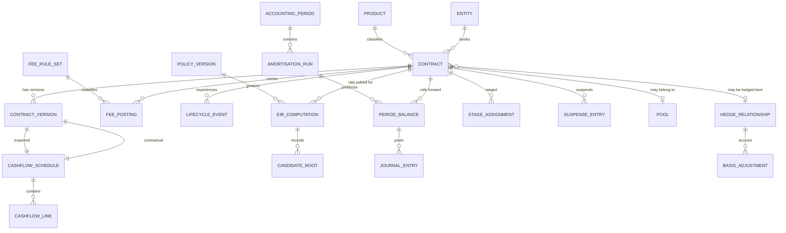

# 04 — Data Model

Entities, relationships and temporal design. Field lists are the *minimum* viable set; a real
implementation will carry more, but nothing here is optional.

The single organising principle: **the engine stores the inputs and the policy version alongside
every result, so any published figure can be reproduced years later under the reading then in
force.** Everything below serves that.

---

## 1. Entity map

---

## 2. Core entities

### 2.1 `CONTRACT` — the stable identity

Immutable identity; everything that changes lives in `CONTRACT_VERSION` or the event stream.

| Field | Notes |
|---|---|
| `contract_id` | Surrogate key |
| `source_system_ref` | The CBS/LMS account number. The join key for reconciliation. |
| `entity_id` | Booking entity — supports multi-entity, entity-specific policy |
| `product_id` | → `PRODUCT` |
| `currency` | ISO 4217. Drives presentation scale. |
| `measurement_category` | `AMORTISED_COST` \| `FVOCI` \| `FVTPL`. **FVTPL carries no EIR** (FR-103). |
| `instrument_class` | `LOAN` \| `INVESTMENT` \| `OFF_BALANCE_SHEET` \| `LIABILITY` |
| `sppi_outcome` / `sppi_assessed_on` / `sppi_approver` | The classification gate (FR-104) |
| `is_poci` / `poci_basis` | POCI on acquisition terms, ACPIR 6(3)(v) |
| `materiality_tier` / `tier_basis` | 1 \| 2 \| 3, with the recorded basis (FR-107) |
| `initial_recognition_date` | For a commitment, the date the bank became party to the irrevocable commitment (ACPIR 23) |
| `book_id` | Parallel books — ACPIR basis, IGAAP, tax (FR-109) |

### 2.2 `PRODUCT` — the shared taxonomy

**One taxonomy, two consumers.** The same tag drives the EIR engine and the provisioning engine's
floor categories. Divergence between them is a control failure, not a mapping inconvenience.

| Field | Notes |
|---|---|
| `product_id`, `product_name` | |
| `acpir_floor_category` | The ACPIR 82 category. Gold loans have their **own** category and must never be grouped under secured retail (ACPIR 92, FR-106). |
| `default_tier` | Default materiality tier |
| `expected_life_method` | `CONTRACTUAL` \| `NEXT_REPRICING` \| `BEHAVIOURAL` |
| `b544_election` | Whether the next-repricing shortcut applies. **Per product, not per contract** (FR-508). |
| `rollover_treatment` | `NEW_INSTRUMENT` \| `REVOLVING_SUBSTANCE` (FR-513) |
| `projection_strategy` | Selects the projector — annuity, bullet, revolving, discount, tranched |
| `day_count_default`, `compounding_default` | Actual/365 for money market; commonly 30/360 for term loans |
| `revolving_approximation` | `FEE_OVER_RENEWAL` \| `EIR_OVER_UTILISATION` (ACPIR 54) |
| `drawdown_probability_threshold` | The numeric definition of "probable" for commitment fees (FR-204) |

### 2.3 `CONTRACT_VERSION` — terms as at a point in time

A new version on every contractual change. Bitemporal: `valid_from`/`valid_to` for business time,
`recorded_at`/`superseded_at` for system time. See [§5](#5-temporal-design).

| Field | Notes |
|---|---|
| `contract_version_id`, `contract_id`, `version_no` | |
| `valid_from`, `valid_to`, `recorded_at`, `superseded_at` | Bitemporal |
| `principal`, `contractual_rate`, `rate_type` | `rate_type` ∈ `FIXED` \| `FLOATING`. **Routing keys off this** (FR-507). |
| `benchmark_id`, `spread_bps`, `reset_frequency`, `next_reset_date` | Floating-rate terms |
| `day_count_convention`, `compounding_basis` | |
| `contractual_maturity_date` | |
| `eir_expected_life_months` | ACPIR 51 — expected life |
| `ecl_horizon_months` | ACPIR 46(1) — maximum contractual period. **A separate field** (FR-108). |
| `life_divergence_basis` | Required where the two differ |
| `moratorium_type`, `moratorium_months`, `capitalises_interest` | ACPIR 9(6)(i); IDC pre-COD |
| `call_terms`, `put_terms`, `extension_terms`, `prepayment_terms` | |
| `acpir_51_fallback` / `fallback_justification` | The contractual-life fallback election (FR-310) |

> **The two-lives rule, enforced in the schema.** `eir_expected_life_months` and
> `ecl_horizon_months` are separate columns with no derivation between them, and
> `life_divergence_basis` is `NOT NULL` where they differ. Collapsing them into one field is the
> most common data-model defect in this domain, and it is the kind that cannot be fixed later
> without reworking every historical computation.

### 2.4 `CASHFLOW_SCHEDULE` and `CASHFLOW_LINE`

Two schedules per contract version: `CONTRACTUAL` and `EXPECTED`.

| `CASHFLOW_SCHEDULE` field | Notes |
|---|---|
| `schedule_id`, `contract_version_id` | |
| `kind` | `CONTRACTUAL` \| `EXPECTED` |
| `source` | `LMS_AUTHORITATIVE` \| `DERIVED`. Prefer the former (FR-102). |
| `residue_policy` | `FINAL_PERIOD_PLUG` \| `FIRST_PERIOD_PLUG` \| `SPREAD_LAST_N` \| `LMS_AUTHORITATIVE` |
| `cpr_curve_version` | Where behavioural life applies |

| `CASHFLOW_LINE` field | Notes |
|---|---|
| `line_id`, `schedule_id`, `sequence_no`, `flow_date` | |
| `amount` | `NUMERIC(24,6)`, signed from the holder's perspective |
| `kind` | `DISBURSEMENT`, `PRINCIPAL`, `INTEREST`, `COMBINED_EMI`, `INTEGRAL_FEE_RECEIVED`, `INTEGRAL_COST_PAID`, `BALLOON`, `EXPECTED_PREPAYMENT`, `RESIDUAL_VALUE`, `NOTIONAL_REDEMPTION` |
| `driver` | The rate-component driver tag. Feeds event routing ([§2.7](#27-lifecycle_event)). |
| `is_contingent` | Contingent flows are **rejected** by the projector (FR-206) |

### 2.5 `FEE_POSTING` and `FEE_RULE_SET`

| `FEE_POSTING` field | Notes |
|---|---|
| `posting_id`, `contract_id`, `fee_code`, `amount`, `posted_on`, `payer` | |
| `cost_function` | `SELLING` \| `PROCESSING` \| `ADMIN` \| `OTHER`. **Rejected if absent** (FR-203) — the ACPIR 53 selling-versus-processing line. |
| `classification` | Resolved value; `EXCLUDED_BY_DIRECTION` for penal charges |
| `rule_set_version_id` | The version that classified it. Enables replay. |
| `drawdown_probability` | Required on commitment fees (FR-204) |
| `linked_facility_id` | |

`FEE_RULE_SET` is a versioned artefact: `(fee_code, product_id, entity_id, effective_from)` →
`classification`, with `maker`, `checker`, `approved_at`, and `impact_preview_ref`. Immutable once
approved. Most-specific-wins resolution with a mandatory default per fee code; an unmapped code
raises rather than defaults (FR-202).

### 2.6 `EIR_COMPUTATION` — the audit anchor

One row per solve. This is the table an auditor reads.

| Field | Notes |
|---|---|
| `computation_id`, `contract_id` \| `pool_id`, `computed_as_of` | |
| `trigger` | `INITIAL_RECOGNITION` \| `RESET` \| `MODIFICATION` \| `DERECOGNITION` \| `POOL_EXIT` \| `TRANSITION` |
| `rate_periodic` | `NUMERIC(20,12)` — the **persisted and used** rate (FR-404) |
| `rate_effective_annual`, `rate_nominal_annual` | Both stored, both labelled (FR-405) |
| `rate_kind` | `EIR` \| `CREDIT_ADJUSTED_EIR` \| `DEEMED_EIR` |
| `convention` | `PERIODIC_INDEX` \| `ACTUAL_DATE`, and the precondition check outcome |
| `opening_carrying_amount` | GCA₀ for EIR; amortised cost for credit-adjusted |
| `solver_method` | `NEWTON` \| `BISECTION_FALLBACK` |
| `iterations`, `residual_at_stored_rate` | |
| `status` | `SOLVED` \| `REQUIRES_REVIEW` \| `NO_SOLUTION` \| `MULTIPLE_ROOTS` |
| `flow_vector_ref` | The exact vector solved |
| `policy_version_id`, `rule_set_version_id` | **The reading in force.** Without these, replay is impossible. |
| `superseded_by` | Never updated in place |

`CANDIDATE_ROOT` records every root found on a multiple-roots disambiguation, so the choice is
auditable (FR-403).

### 2.7 `LIFECYCLE_EVENT`

| Field | Notes |
|---|---|
| `event_id`, `contract_id`, `event_date`, `event_type` | |
| `driver` | `TIME_VALUE_OF_MONEY`, `CREDIT_RISK_MARKET`, `CREDIT_RATCHET_PREDETERMINED`, `ESG_LINKED`, `STEP_UP_PREDETERMINED`, `BEHAVIOURAL_ESTIMATE`, `DISBURSEMENT_TIMING`, `NEGOTIATED` |
| `routed_mechanism` | `RESET` \| `CATCH_UP` \| `MODIFICATION_TEST` \| `DERECOGNITION` \| `NONE` |
| `routing_table_version_id` | **Which mapping produced the routing.** The point of [ADR-0006](adr/0006-configurable-event-routing.md). |
| `prepayment_variant` | `TENOR_REDUCED` \| `EMI_REDUCED` — carried on the event, never inferred (FR-509) |
| `catch_up_amount`, `original_eir_used` | For catch-up events |
| `ten_percent_test_result`, `qualitative_triggers` | Evidence, not decision (FR-511) |
| `substantiality_conclusion`, `decided_by`, `decided_at` | The human decision and its owner |
| `sequence_within_date` | Deterministic intra-period ordering |

### 2.8 `PERIOD_BALANCE` — the sub-ledger row

One row per contract per period per book. The reporting workhorse.

| Field | Notes |
|---|---|
| `balance_id`, `contract_id`, `period_id`, `book_id`, `run_id` | |
| `opening_gca`, `closing_gca` | Gross carrying amount — the EIR leg |
| `opening_contractual`, `closing_contractual` | The contractual leg. Ties to the CBS. |
| `eir_interest`, `contractual_interest` | The two legs |
| `fee_amortised` | Derived: `eir_interest − contractual_interest` |
| `unamortised_fee` | **Derived** as `closing_contractual − closing_gca`, never accumulated independently (invariant INV-4) |
| `cash_received` | |
| `catch_up_amount` | |
| `stage` | 1 \| 2 \| 3, from `STAGE_ASSIGNMENT` |
| `allowance` | ECL allowance consumed |
| `shadow_unwind` | `allowance × EIR`. Computed, **not** recognised (FR-603). |
| `recognised_interest_income` | **Zero when stage 3** (invariant S3-2) |
| `suspense_movement` | → `SUSPENSE_ENTRY` |
| `ecl_pre_floor`, `ecl_post_floor` | Both retained (FR-609, invariant PF-1) |
| `basis_adjustment_amortised` | Hedge interaction |

> **Derived, not stored, on purpose.** `unamortised_fee` and `fee_amortised` are computed from the
> two legs rather than maintained as accumulators. An accumulator can drift from the balances it
> describes; a derivation cannot. This is invariant INV-4 expressed in the schema rather than
> checked after the fact.

### 2.9 `STAGE_ASSIGNMENT` and `SUSPENSE_ENTRY`

`STAGE_ASSIGNMENT` carries `contract_id`, `period_id`, `stage`, `allowance`,
`ecl_engine_version`, `received_at`. The version is what makes a Stage 3 replay deterministic —
without it, re-running a period with today's ECL output produces a different answer and DT-1 fails.

`SUSPENSE_ENTRY` is a **first-class ledger object**, not a memorandum (FR-604):
`contract_id`, `period_id`, `contractual_interest_suspended`, `opening_balance`,
`closing_balance`, `released_on_recovery`, `written_off`.

### 2.10 `POOL`

| Field | Notes |
|---|---|
| `pool_id`, `definition_version_id`, `struck_on` | |
| `homogeneity_criteria` | Product × origination month × rate band × tenor band |
| `is_closed_cohort` | Always true. Members are never added after the EIR is struck. |
| `pool_eir` | |
| `last_backtest_on`, `backtest_variance`, `backtest_threshold` | Mandatory quarterly (FR-409) |
| `forced_to_contract_level` | Set when the threshold is breached |

### 2.11 `HEDGE_RELATIONSHIP` and `BASIS_ADJUSTMENT`

| Field | Notes |
|---|---|
| `relationship_id`, `hedged_contract_id` \| `portfolio_id`, `hedging_instrument_ref` | |
| `designated_risk` | Benchmark rate risk only — **not** credit spread (FR-701) |
| `level` | `INSTRUMENT` \| `PORTFOLIO` (IAS 39 89–94 carve-out) |
| `status` | `LIVE` \| `DISCONTINUED` |
| `discontinued_on` | |
| `amortisation_schedule_id` | **`NOT NULL` where status is `DISCONTINUED`** — invariant HB-1 as a constraint |

Encoding HB-1 as a database constraint rather than only a runtime check is deliberate: the frozen
basis adjustment is the most commonly observed defect in this area, and it persists silently for
years once established.

### 2.12 `POLICY_VERSION`

The interpretive hierarchy as data: which reading resolves each ACPIR silence, the driver-to-mechanism
routing table version, materiality thresholds, tier assignment rules, the residue policy, the
liability-side election, day-count defaults. With `maker`, `checker`, `approved_at`,
`effective_from`, `impact_preview_ref`. Immutable once approved.

### 2.13 `ACCOUNTING_PERIOD` and `AMORTISATION_RUN`

`ACCOUNTING_PERIOD` carries `status` ∈ `OPEN` \| `CLOSING` \| `CLOSED`. **`CLOSED` is immutable**
(FR-902): a correction creates a restatement artefact referencing the original.

`AMORTISATION_RUN` carries `run_id`, `period_id`, `started_at`, `completed_at`, `status`,
`contracts_processed`, `exceptions_raised`, `invariant_results`, `is_replay`,
`replay_of_run_id`. Runs are idempotent and replayable — the same inputs and policy version
produce byte-identical output (FR-903).

---

## 3. Exception queue

`EXCEPTION` — `contract_id`, `raised_by_run_id`, `category`, `detail`, `payload_ref`, `status`,
`resolved_by`, `resolution_note`.

Categories: `UNMAPPED_FEE_CODE`, `MISSING_COST_FUNCTION`, `NO_SOLUTION`, `MULTIPLE_ROOTS`,
`MISSING_MANDATORY_FIELD`, `PENAL_CHARGE_REJECTED`, `IC1_BREACH`, `STALE_EQUIVALENCE_TEST`,
`DISCONTINUED_HEDGE_NO_SCHEDULE`, `POOL_BACKTEST_BREACH`.

Every category is a **hard stop for that contract**, never a silent default (FR-905). Unresolved
exceptions block the close unless explicitly accepted with approval.

---

## 4. Physical design

| Concern | Approach |
|---|---|
| Engine | PostgreSQL 16+ |
| Money | `NUMERIC(24,6)` at rest — six decimals holds working values above presentation scale without floating-point |
| Rates | `NUMERIC(20,12)` — matches the 12dp storage policy exactly |
| Partitioning | `PERIOD_BALANCE`, `JOURNAL_ENTRY`, `CASHFLOW_LINE` range-partitioned by `period_id`; a closed period's partitions are set read-only |
| Indexing | `(contract_id, period_id)` for the trace path; `(run_id, status)` for run monitoring; `(period_id, product_id)` for reporting rollups |
| Volume | 10M contracts × 12 periods × ~30 columns ≈ 120M `PERIOD_BALANCE` rows/year. Partition pruning is what keeps close-period queries tractable. |
| Retention | Closed-period partitions archived to columnar storage after the statutory retention boundary; `EIR_COMPUTATION` never archived — it is the audit anchor |

---

## 5. Temporal design

Three distinct time axes, and conflating any two of them breaks replay.

| Axis | Meaning | Where |
|---|---|---|
| **Business time** | When the fact was true in the world | `valid_from` / `valid_to` |
| **System time** | When the engine learned it | `recorded_at` / `superseded_at` |
| **Accounting time** | Which reporting period it belongs to | `period_id` |

Consequences:

- A **backdated contractual amendment** is a new `CONTRACT_VERSION` with an earlier `valid_from` and
  a current `recorded_at`. The already-closed periods keep their published figures; the amendment
  produces a restatement artefact in the current period. History is never rewritten.
- A **replay** of a closed period reads the version set as at that period's `recorded_at` boundary
  and the policy version effective then — not today's. This is what DT-1 verifies nightly.
- **Nothing in the calculation path reads a wall clock.** Time is an input, always. This is the
  single constraint that makes determinism achievable, and it is why `LocalDate` rather than
  `Instant` appears throughout ([03 §1.1](03-calculation-spec.md#11-types)).

---

## 6. Transition-specific structures

For the ACPIR 19–21 and 50 transition ([08 § roadmap](08-roadmap.md)):

| Structure | Purpose |
|---|---|
| `TRANSITION_FAIR_VALUE` | Per contract at 1 April 2027: pre-transition carrying amount, fair value, difference to opening retained earnings, and the **paragraph 19 rebuttal evidence reference** where carrying cost was taken as best evidence of fair value |
| `LEGACY_COHORT` | Cohort definition, expected run-off relative to 31 March 2030, migration priority, method (`FULL_RECONSTRUCTION` \| `DEEMED_EIR`) |
| `DEEMED_EIR_DERIVATION` | The documented basis for a deemed rate where full reconstruction was not feasible (FR-909) |
| `ECL_DISCOUNT_BASIS` | Per contract per period: `CONTRACTUAL_INTERIM` \| `EIR`, tracking migration against the ACPIR 50 deadline |

`ECL_DISCOUNT_BASIS` exists because ACPIR 21 and ACPIR 50 are **two obligations with a common
deadline**, not one: the loan must come under the EIR regime, and its ECL discounting must migrate
to the EIR. Tracking them in one field would hide a gap.
