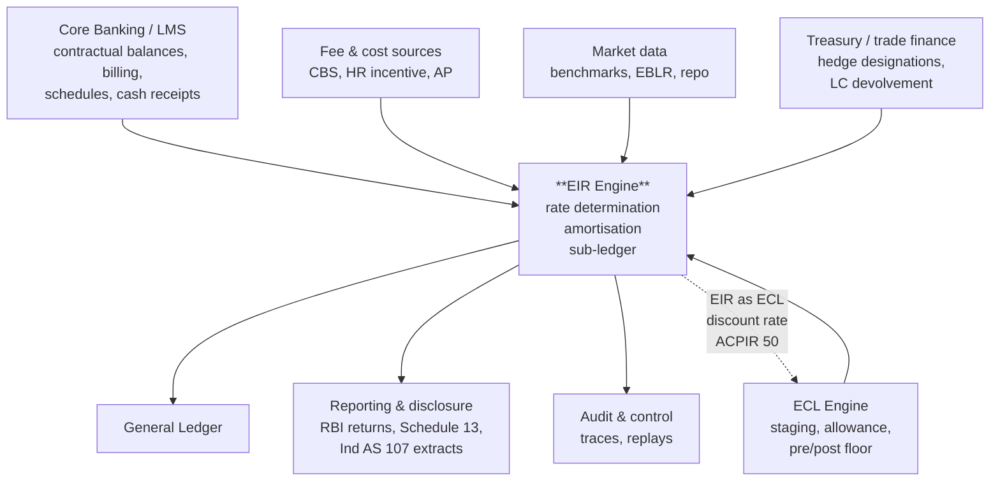
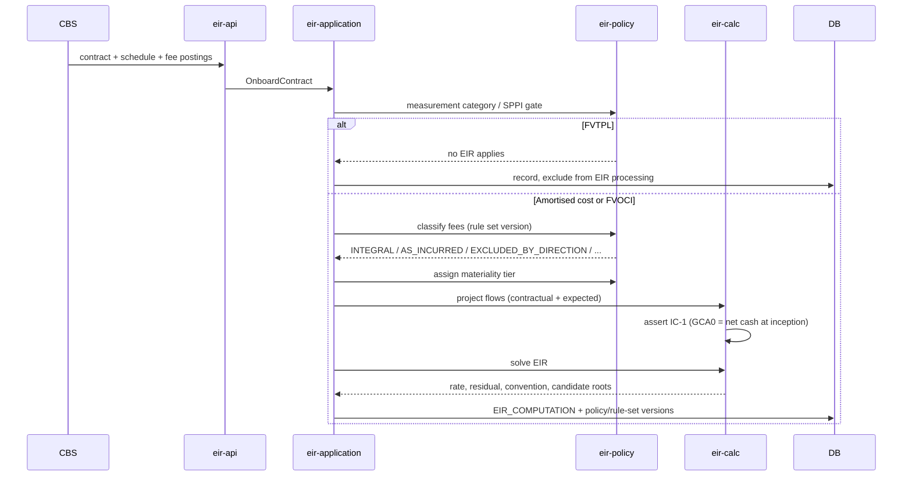

# 05 — Architecture

Java 21 / Spring Boot. Decisions carry rationale here and are recorded formally in
[docs/adr](adr/).

---

## 1. Context



Note the dotted line. ACPIR 50 makes the EIR the ECL discount rate, so the two engines are
**mutually dependent**: staging flows in, the rate flows back. That cycle is the single most
important integration fact in the system, and it is why sequencing matters —
[08 § sequencing](08-roadmap.md).

### 1.1 The boundary that matters most

The engine is **not** the customer-facing book of record. The CBS/LMS remains authoritative for
contractual balances, billing and borrower statements; this engine computes the accounting overlay.
See [ADR-0004](adr/0004-delta-over-contractual-ledger.md) — the most consequential decision in the
design, and the one that keeps reconciliation to the CBS tractable.

### 1.2 The boundary that will be pushed

ECL. Interest recognition depends on staging, staging is an ECL output, and ACPIR 50 makes the EIR
the ECL discount rate — so there will be pressure to merge them. They should stay separate:
impairment modelling is a statistical discipline with different owners, a different release cadence
and different validation requirements. The engine consumes staging and allowance as **versioned
inputs** and records the version consumed, which is what makes a Stage 3 replay deterministic.

---

## 2. Module structure

Multi-module Maven build. Dependencies point strictly inward.

```
eir-domain          pure Java: value objects, money, rates, day counts, invariants.
                    ZERO framework dependencies. No Spring, no JPA, no Jackson.
eir-calc            projection strategies, the solver, amortisation, event routing.
                    Depends only on eir-domain.
eir-policy          policy/rule-set resolution, driver-to-mechanism routing table,
                    tier assignment, versioning.
eir-application     use-case orchestration, transaction boundaries, ports.
eir-persistence     JPA mappings, repositories, Flyway migrations.
eir-batch           Spring Batch: amortisation runs, close, replay, transition jobs.
eir-gl              journal construction, GL adapter.
eir-api             REST controllers, DTOs, OpenAPI.
eir-app             Spring Boot assembly and configuration.
```

### 2.1 Why `eir-domain` and `eir-calc` are framework-free

Three reasons, in order of weight:

1. **Testability of the thing that matters.** The 9 reference cases run as plain JUnit against
   `eir-calc` with no Spring context, no database, no fixtures. A full-portfolio invariant sweep
   runs in seconds. If the mathematics needed a container to test, it would be tested less.
2. **They are the audit surface.** An auditor's question is about the arithmetic, not the wiring.
   Keeping the arithmetic in a module with no I/O makes it readable as mathematics.
3. **Longevity.** Framework generations turn over faster than accounting standards. The EIR
   mechanics outlive Spring versions.

A build-failing enforcement rule (`maven-enforcer` banned-dependencies) rejects any framework
dependency in these two modules, alongside the `double`/`float` lint rule from
[03 §1.1](03-calculation-spec.md#11-types).

### 2.2 Modular monolith, not microservices

See [ADR-0001](adr/0001-modular-monolith.md). The short version: the workload is a single
transactional close over one consistent dataset with cross-cutting invariants. Distributing it buys
deployment independence nobody asked for and costs distributed transactions, eventual consistency
in a ledger, and cross-service invariant checking — all of which are the wrong trades for something
whose defining requirement is that the numbers tie.

---

## 3. Runtime views

### 3.1 Initial recognition



The SPPI/measurement gate runs **first**, before any projection or solve. On the asset side an SPPI
failure is a cliff, not a gradient: the whole instrument goes to FVTPL and no EIR arises. Doing
expensive work before that check is waste, and worse, produces a rate for an instrument that should
not have one.

### 3.2 Month-end amortisation run

```mermaid
sequenceDiagram
    participant SCH as Scheduler
    participant BATCH as eir-batch
    participant CALC as eir-calc
    participant POL as eir-policy
    participant DB
    participant GL

    SCH->>BATCH: start run (period, book)
    BATCH->>DB: verify all upstream feeds received + versioned
    BATCH->>BATCH: partition by product x entity
    loop each partition, in parallel
        loop each contract, chunked
            BATCH->>DB: load contract, prior balance, events, staging
            alt event present
                BATCH->>POL: route by driver tag
                POL-->>BATCH: RESET | CATCH_UP | MODIFICATION_TEST
                opt RESET
                    BATCH->>CALC: re-solve from current GCA
                end
                opt CATCH_UP
                    BATCH->>CALC: restate at ORIGINAL EIR
                end
            end
            BATCH->>CALC: roll forward (gross basis)
            opt stage 3
                BATCH->>CALC: compute shadow unwind; suppress income
            end
            BATCH->>CALC: assert per-contract invariants
            BATCH->>DB: PERIOD_BALANCE + journals
        end
    end
    BATCH->>DB: aggregate invariants (SL-1, PF-1, HB-1, TG-1)
    BATCH->>GL: summarised postings
```

Note where the solve sits: **inside the event branch only**. A fixed-rate contract with no events
never re-solves. The steady-state run is overwhelmingly roll-forward arithmetic, which is what makes
the 10M-contract target reachable ([03 §4.6](03-calculation-spec.md#46-performance)).

### 3.3 Replay

A replay is the same batch job with `is_replay = true` and an as-at boundary. It reads the contract
version set as at the original run's `recorded_at`, the policy and rule-set versions effective then,
and the ECL input version consumed then. Output goes to a shadow table and is compared
byte-for-byte with the published figures — invariant DT-1, run nightly against a sampled period.

Replay is not a reporting feature added at the end. It is the reason the data model is bitemporal
and the reason nothing in the calculation path reads a wall clock.

---

## 4. Key design elements

### 4.1 The solver

`eir-calc` exposes `RateSolver` with a single method over a flow vector and a target. Newton–Raphson
with an analytic derivative inside a bracket, bisection fallback, per
[03 §4](03-calculation-spec.md#4-the-solver). Stateless, deterministic, framework-free, and
exhaustively unit-tested including the [Case 7](reference-cases/case-07-solver-stress.md) stress
instruments.

The one behaviour worth restating in an architecture document: **non-convergence raises**. It never
falls back to the contractual rate. A silent fallback reproduces the pre-ACPIR position while
appearing to have implemented EIR, and leaves no trace.

### 4.2 Event routing as configuration

```java
// eir-policy
public interface EventRouter {
    Mechanism route(RateDriver driver, RateType rateType, RoutingTableVersion version);
}
```

The mapping from `RateDriver` to `Mechanism` is **data in a versioned table**, not a `switch`
statement. This is [ADR-0006](adr/0006-configurable-event-routing.md) and it exists because the IASB
is actively amending B5.4.5: the April 2026 tentative decision would route ESG ratchets and
pre-determined step-ups to a catch-up rather than a reset, with an Exposure Draft expected H2 2026.

When the final wording lands, the change is an approved policy version with an impact preview — not
a code change, a regression-test cycle and a release. Build the switch, not the constant.

Every `LIFECYCLE_EVENT` stores the `routing_table_version_id` that produced its routing, so a replay
reproduces the routing in force at the time.

### 4.3 Projection strategies

```java
public interface CashflowProjector {
    boolean supports(Product product, ContractVersion version);
    ProjectionResult project(ContractVersion version, PolicyVersion policy);
}
```

Implementations: `AnnuityProjector`, `StepScheduleProjector`, `BulletProjector`,
`BalloonProjector`, `TranchedProjector`, `MoratoriumProjector`, `RevolvingProjector`,
`DiscountInstrumentProjector`, `ExternalScheduleProjector` (the `LMS_AUTHORITATIVE` path).

Revolving facilities get their **own** projector rather than being forced through the annuity path.
Cash credit, overdraft, credit cards and KCC have no contractual repayment schedule; ACPIR 54
explicitly contemplates that the EIR cannot be determined directly for them and permits an
approximation. Bending them into an annuity shape to reuse code produces a number with no meaning.

`ExternalScheduleProjector` is preferred in production wherever the CBS can supply the billed
schedule, because a derived schedule the CBS did not bill guarantees a monthly reconciliation break
([03 §7.3](03-calculation-spec.md)).

### 4.4 Money and precision

`eir-domain` provides `Money` (amount + currency, presentation scale from ISO 4217) and `Rate`
(12dp storage, both annualisations, labelled). All arithmetic at `MathContext(28, HALF_UP)`;
rounding to currency scale happens once, at the persistence boundary. No `double` anywhere —
enforced at build time.

### 4.5 Failure isolation

Per-contract failure isolation is a hard requirement (FR-905): one malformed contract must not fail
a ten-million-contract close. Implemented as Spring Batch skip policy plus a fault barrier per
chunk item — the contract routes to the exception queue with its payload, the chunk continues, and
the run completes with a non-zero exception count that the close workflow then gates on.

The distinction that matters: a **contract-level** failure is isolated; an **aggregate invariant**
failure (SL-1, PF-1, HB-1) fails the run, because it means the whole set is untrustworthy.

---

## 5. Technology choices

| Concern | Choice | Rationale |
|---|---|---|
| Language | Java 21 | Records for value objects, sealed interfaces for the event hierarchy, pattern matching for routing. LTS. Prevailing skill base in Indian banking technology. |
| Framework | Spring Boot 3.x | Spring Batch is the deciding factor — the workload is a partitioned, restartable, chunk-oriented batch, which is exactly what it is for. |
| Batch | Spring Batch | Partitioned steps, restartability, skip policies, run metadata. See [ADR-0007](adr/0007-spring-batch-for-runs.md). |
| Database | PostgreSQL 16+ | Range partitioning, `NUMERIC` at arbitrary precision, strong transactional guarantees, mature bitemporal patterns. |
| Migrations | Flyway | Versioned, forward-only, reviewable. |
| Persistence | Spring Data JPA + jOOQ for reporting | JPA for the transactional entity graph; jOOQ where reporting needs set-based SQL that JPA obscures. |
| API | REST + OpenAPI 3 | Contract-first. See [06](06-api-spec.md). |
| Build | Maven | Module boundary enforcement via `maven-enforcer`. |
| Testing | JUnit 5, AssertJ, Testcontainers, jqwik | jqwik for property-based invariant testing — see [§6](#6-testing-strategy). |
| Observability | Micrometer + OpenTelemetry | Per-run, per-partition, per-invariant metrics. |

### 5.1 Why not a rules engine (Drools et al.)

Considered for fee classification and event routing, rejected. Both are **table lookups with
versioning and approval**, not inference over a complex fact base. A versioned mapping table in
PostgreSQL with maker–checker gives auditability that a rules engine's working memory does not, and
the resolution logic is fifty lines. Introducing a rules engine would add an opaque evaluation step
to the middle of the audit trail — precisely where opacity is most expensive.

### 5.2 Why not event sourcing throughout

The contract timeline **is** event-sourced — `LIFECYCLE_EVENT` is the source of truth and balances
are derived by replay ([ADR-0003](adr/0003-event-sourced-recompute.md)). But `PERIOD_BALANCE` is a
materialised projection that is stored, not recomputed on read, because closed-period figures are
published financial statements: they must be retrievable exactly as published, cheaply, years later.
Recomputing them on read would make every audit query a full replay and would risk drift the moment
any code path changed.

Event-sourced for the timeline; materialised and immutable for the published figures.

---

## 6. Testing strategy

| Layer | Approach |
|---|---|
| Reference cases | All 9 as plain JUnit against `eir-calc`. **A merge gate.** Any deviation fails the build. |
| Invariants | Property-based (jqwik) over generated contracts: random tenors, rates, fee structures, event sequences. Every invariant from [03 §9](03-calculation-spec.md#9-invariants) asserted on every generated contract. |
| Day counts | Table-driven per convention against published vectors, with explicit month-end and leap-year coverage. |
| Solver | Convergence on the stress instruments; correct raising on `NoSolution` and `MultipleRoots`; **explicit test that no path defaults to the contractual rate**. |
| Event routing | Every driver × rate-type combination against the routing table; explicit test that a renegotiated fixed rate does not route to `RESET`. |
| Stage 3 | ST-2 identity on generated allowances; S3-2 nil recognition; cure with no catch-up. |
| Determinism | Same inputs run twice → byte-identical output. Then run under a shifted system clock → still identical (proves no wall-clock read). |
| Batch | Testcontainers PostgreSQL, 100k-contract fixture, restart-mid-run, per-contract failure isolation. |
| Reconciliation | Synthetic full-portfolio close asserting SL-1 and SL-2 end to end. |

The property-based invariant sweep is the highest-value test in the suite. The reference cases prove
the engine is right on nine specific instruments; the invariant sweep proves it cannot be wrong in a
structurally-detectable way on any instrument it can represent.

---

## 7. Deployment and scale

| Concern | Approach |
|---|---|
| Topology | Single application, horizontally scalable. Batch runs on dedicated workers; the API on separate instances so a close cannot starve the trace endpoint. |
| Partitioning | Spring Batch partitioned steps by `product × entity`. Partition count tuned to worker count; skew handled by splitting the largest products. |
| Target | 10M contracts inside a 4-hour close window |
| Throughput implication | ~700 contracts/second sustained. Reached because re-solving is event-triggered, not per-period. |
| Read replicas | Reporting and trace queries served from replicas; the close writes to primary. |
| Closed periods | Partitions set read-only at close — immutability enforced in the database, not only in application code. |
